# Improved Box Projected Reflections
My adventures into improving Box Projected Specular Reflections!

*NOTE: In-case it isn't obvious, most of the examples/images shown here are of a pure metallic/reflective material to show the effects more clearly.*

## Contact Hardening

#### Contact Hardening: None

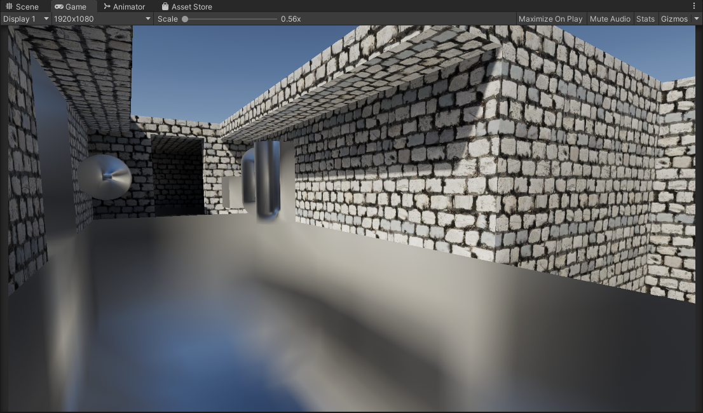

The issue with how box-projected reflections are typically done is that when sampled, the roughness of the reflection is consistent across the entire volume regardless of camera position, and object position. This is not the case when you compare it to a proper raytraced/ground truth result.

With that there are a couple of implementations here that attempt to alleviate that problem and make them more true to life and higher fidelity.

#### Contact Hardening: Approximated

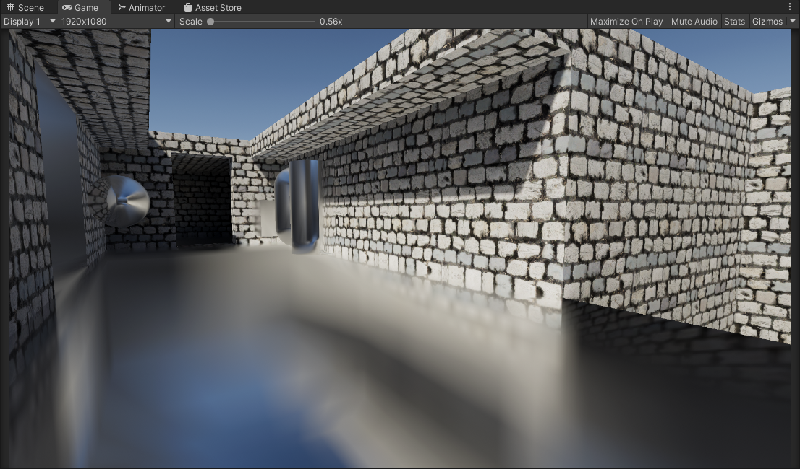

This is done by modifying Unity's existing box projection method to output a hit distance from the bounds of the box, to where the current fragment/pixel is. This hit distance is then used to offset the mip level when sampling the cubemap to be sharper when closer to the bounds of the probe, and rougher when farther from the bounds. It's very cheap and fast, though not accurate as it fails to model anisotropic reflections *(Isotropic, or specular elongation)*.

Despite that, this alleviates a couple of visual problems we saw before. 
1. This attempts to solve the problem of reflections being too consistent across the entire volume, making them look closer to a proper raytraced result. *(I.e the closer to the actual source of the reflection bounds, the sharper the reflection gets)*
2. In most situations this contact hardening actually contributes to improved specular occlusion. Since the contact hardening reflections reveal the underlying cubemap more, there is less of a glowing appearance in the corners of the bounds. *(Note that this is assuming your reflection probe is placed and configured well to approximate the geometry of the space/room)*

This is a marginal improvement over the classic method, and it's really cheap!

***NOTE:*** *The approximation is mostly arbitrarily tweaked by hand with random values until it looks right, or otherwise known as "banging random rocks together until we get something decent". In addition, any possible tricks to help with mimicking anisotropic reflections would help here. 

#### Contact Hardening: HDRP Approximation

This I found about recently, where [Unity HDRP](https://docs.unity.cn/Packages/com.unity.render-pipelines.high-definition@13.1/manual/whats-new-10.html) had a very similar implementation to the original approximation I stumbled upon. The difference being that the approximation used here is less obvious/extreme than the other original approximation I had, and it tries to stay somewhat physically plausible. Comparing it to ground truth it is closer in some cases than the other, for a very similar cost.

Once again, a big improvement over the classic method, and it's really cheap!

#### Contact Hardening: Raytraced

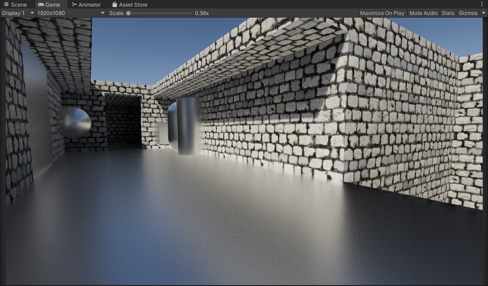

This is the most accurate method out of the previous ones we had. This is equivalent to ground truth, and unlike the approximations it can properly model anisotropic specular *(specular elongation)*. It's the most accurate and best looking one. However in comparison it is more complicated and slower than previous methods and requires alot of samples to mitigate artifacts *(More on this later)*.

It's a massive improvement over the classic method, but it's more complicated and expensive *(Again more on this later, it's not as bad as you think)*

### Contact Hardening Comparisons (Non-Normal Mapped Material)

| None | Approximated | HDRP Approximation | Raytraced |
| ------------- | ------------- | ------------- | ------------- |
|  |  |  |  |

### Contact Hardening Comparisons (Normal Mapped Material)

| None | Approximated | HDRP Approximation | Raytraced |
| ------------- | ------------- | ------------- | ------------- |
| 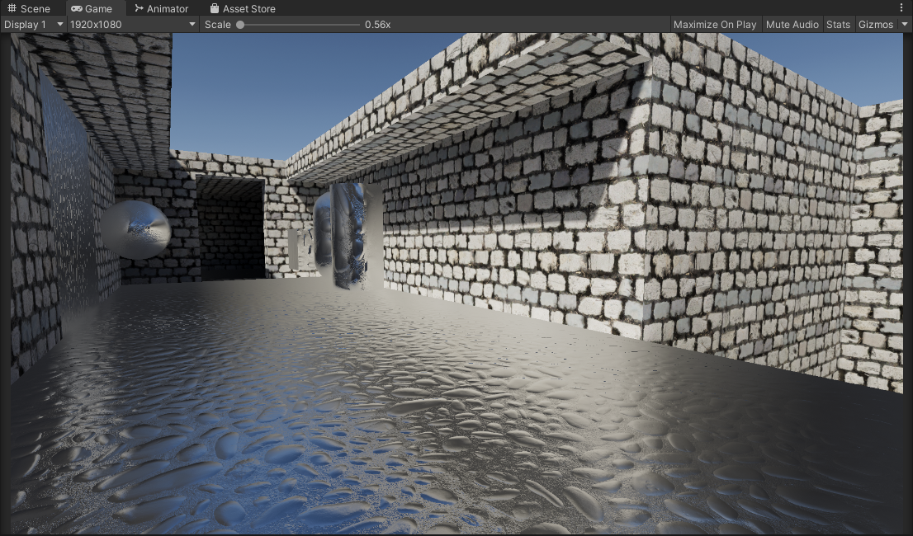 | 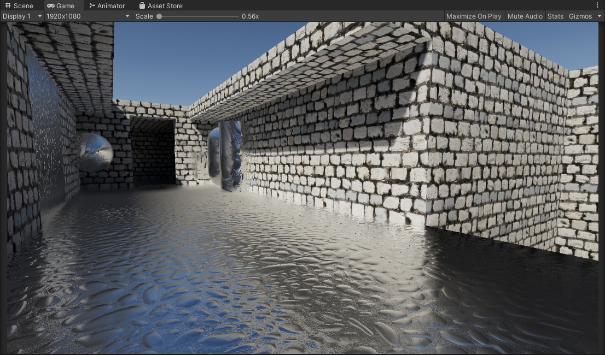 | 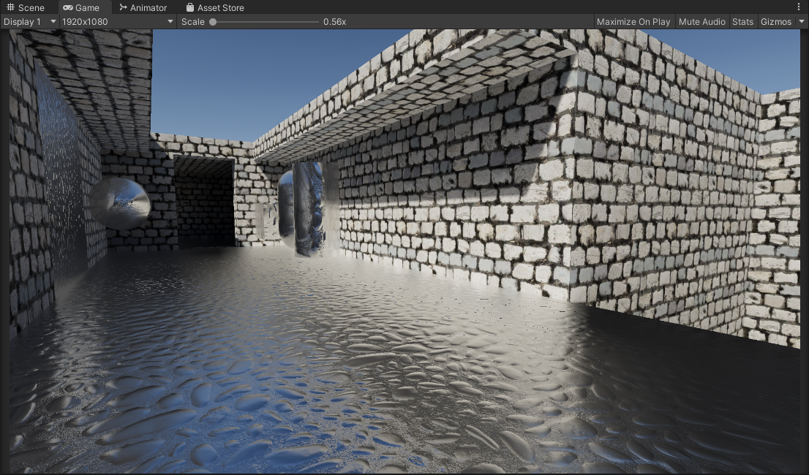 | 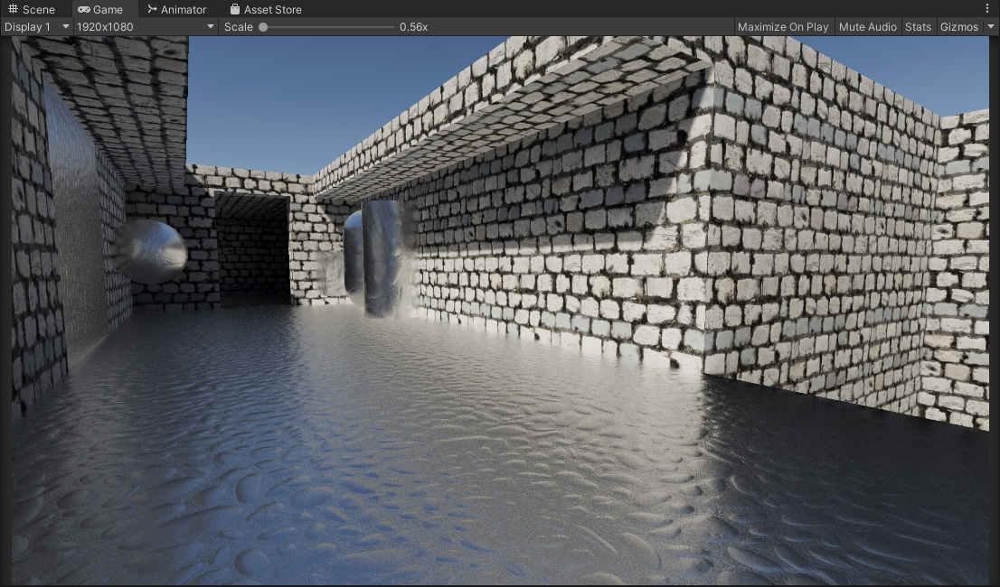 |

#### Contact Hardening: Raytracing Options

Earlier we mentioned that while this method is the most accurate and high quality, it's also expensive when compared to it's approximated counterparts. I also want to note that it's important also to keep in mind the "raytracing" being done here is fairly simple compared to what one might expect, it's just AABB ray testing against the reflection probe bounds. It's all software-based and can even run on a Quest 2 standalone at a decent framerate. With that said there are a few of things we can do here to try to help both improve quality and performance.

The current implementation also is using an Importance Sampled GGX Function for specular convolution, at 64 samples.

The blue noise also being used later in the examples/project is a precomputed 3D Texture with 64 slices (64 iterations). The 3D texture being built from 64 slices of precomputed blue noise textures from [Moments in Graphics by Christoph Peters](https://momentsingraphics.de/BlueNoise.html). I do also have precomputed [Spatio-Temporal Blue Noise (STBN)](https://developer.nvidia.com/blog/rendering-in-real-time-with-spatiotemporal-blue-noise-textures-part-1/) volumes in the project that I also combined, however for some reason the result's I got were worse than with the ones from [Christoph Peters](https://momentsingraphics.de/BlueNoise.html). Might be something I did wrong or incorrectly, someone let me know please!

#### Static Noise *(Non-Deterministic Sampling)*

| Static White Noise | Static Blue Noise |
| ------------- | ------------- |
|  | 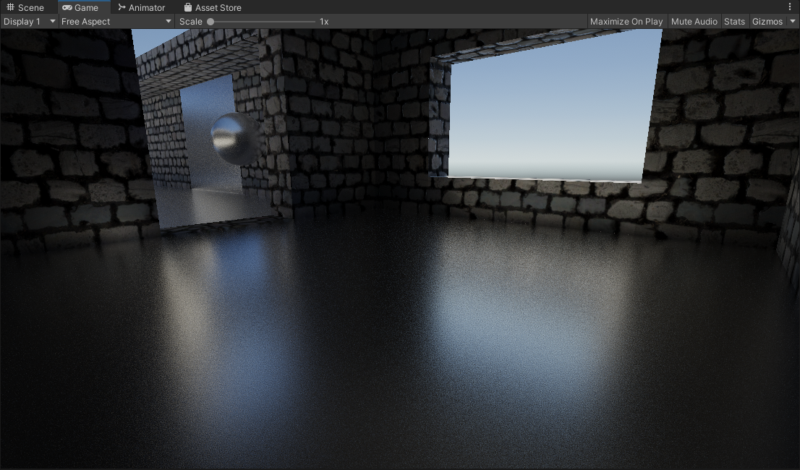 |

By default white noise is being used. In the current implementation we can use blue-noise sampling to try to improve the perceptual quality. Comparing side by side the difference is small in a static scenario like this, but the blue noise is noticably more consistent and pleasing compared to white noise. At lower sample counts obviously the blue noise shows it's strengths more but of course lower samples = lots of noise regardless.

One other thing also featured in the shader is a "Mip Offset" cheat. As it turns out the approximations we have earlier actually work great here and work as a way to blur the results the further the fragment/pixel is. This is something that can be done but in my opinon I would caution against it. Reason being that it alters the reflection properties by blurring the underlying reflection too much, and you lose out on that specular enlongation *(You might as well stick with the approximation at that point to save you an arm and a leg)*.

| Static Blue Noise | Static Blue Noise With Mip Offsetting |
| ------------- | ------------- |
|  | 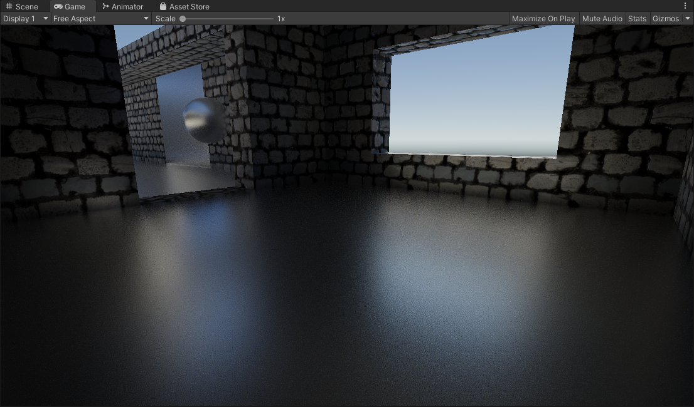 |

#### Animated Noise *(Non-Deterministic Sampling)*

| Animated White Noise | Animated Blue Noise |
| ------------- | ------------- |
| 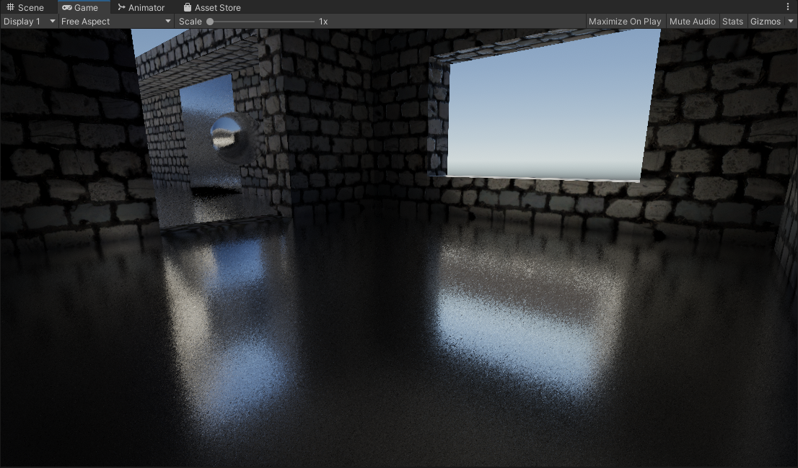 | 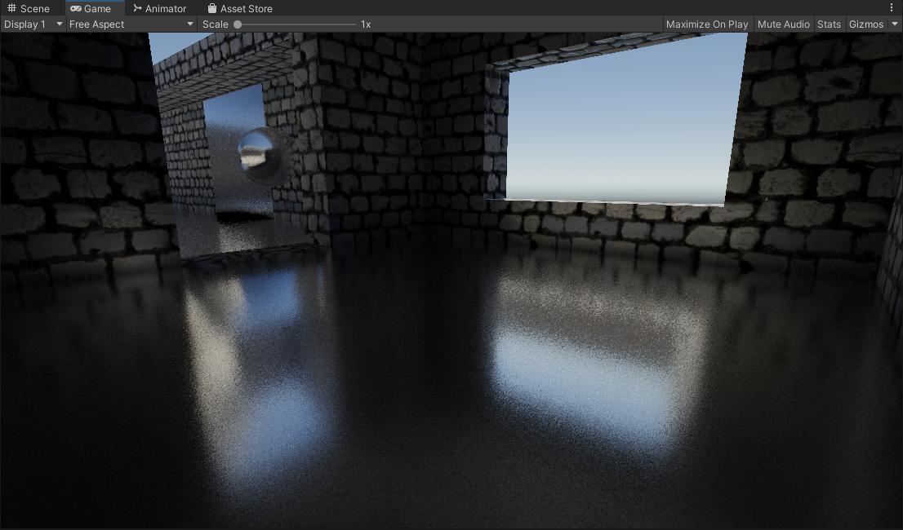 |

One common solution we can try here is to animate the noise, and accumulate samples over time. This scenario is also where blue noise shines the most, since we are using 1 sample per pixel for every frame, and the sample pattern changes every frame. Using Unity's Default TAA Here and with a stationary camera the results get cleaned up very nicely, and it's performant as it's only 1 sample per pixel, accumlated across multiple frames. 

Now obviously the drawback of this solution is that it is temporal, it accumulates results over multiple frames. Because of that you'll have to deal with the problems that come about with temporal rendering such as disocclusion events, changing perspective, ghosting, and that whole mess. Filtering this with an additional blur that is normal aware will help you here but that introduces inaccuracies as well with trying to retain sharp reflections. Pick your poison.

#### Deterministic Sampling

| Deterministic Sampling | Deterministic Sampling With Mip Offset |
| ------------- | ------------- |
| 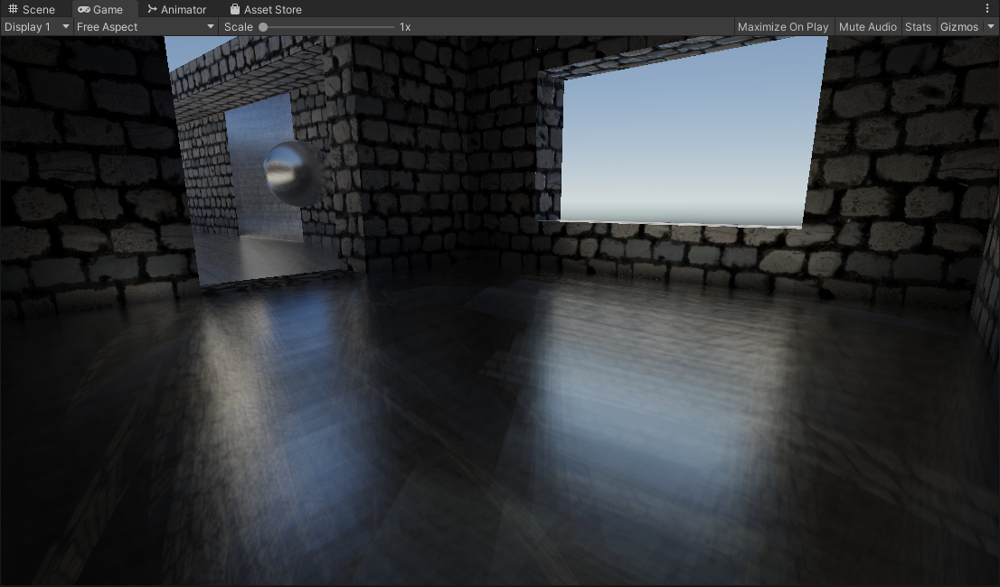 |  |

If you don't like noise, you can choose to forgo Monte-Carlo random sampling and instead go for a more uniform/deterministic sampling type. You swap artifacts from noise to aliasing. Just like the noise however the more samples you have the better. 

I also introduced a comparison with the enabled "Mip Offsetting" approximation which can be used in conjunction with this deterministic sampling approach to get you usable results on smooth surfaces. However just like I mentioned earlier, introducing this does overly blur the reflection and you lose out on that specular elongation.

## Beveled Box Projection

#### Beveled Box Projection: Off

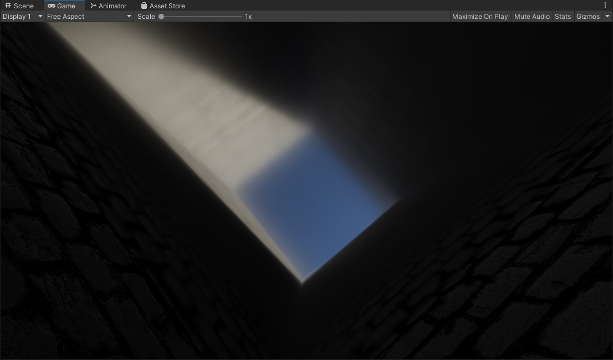

Classic box projection, it's fast and simple, but has sharp edges and can look jarring at grazing angles especially when the cubemap is sampled at a higher mip level.

#### Beveled Box Projection: On
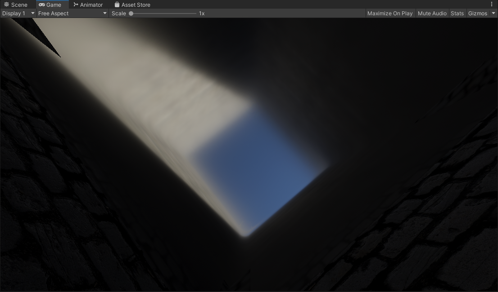

Using a beveled box projection with an adjustable bevel factor, to smooth out the sharp edges you'd get with the classic method.

The initial idea here is 
1. Give an artist-controlled parameter to smooth out the reflection probe projection.
2. A more complex but optically inspired approach by mapping the bevel factor to increased roughness, so the blurrier the reflection gets, the smoother the edges of the box projection are.

Granted the current implementation has artifacts at high bevel values, note the top left and right sides. You also have to deal with added complexity/instruction counts for a bevel box projection. 

**In my opinion**: For most circumstances this is not as transformative as contact hardening, which already visually "un-boxes" the appearance of your box projected reflection for a much cheaper cost.

## Box Based Specular Occlusion

Another oddball thing we can do, since we have the information of an environment with a box shape. We can use the hit distance from that to do a form of specular occlusion. The closer a pixel/fragment is to the bounds of the box, the more occluded it becomes. So in circumstances where push comes to shove you need to occlude specular or reflections, this is a possible route.

#### Box Occlusion: Off

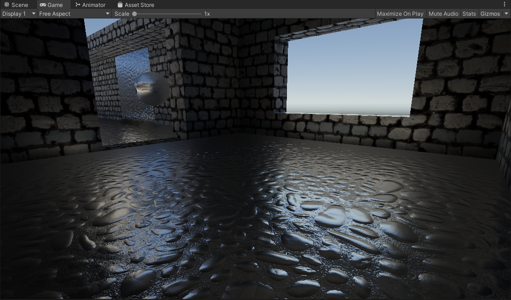

Using the classic box projected reflections, note the glowing apperance where the floor meets the walls.

#### Box Occlusion: On

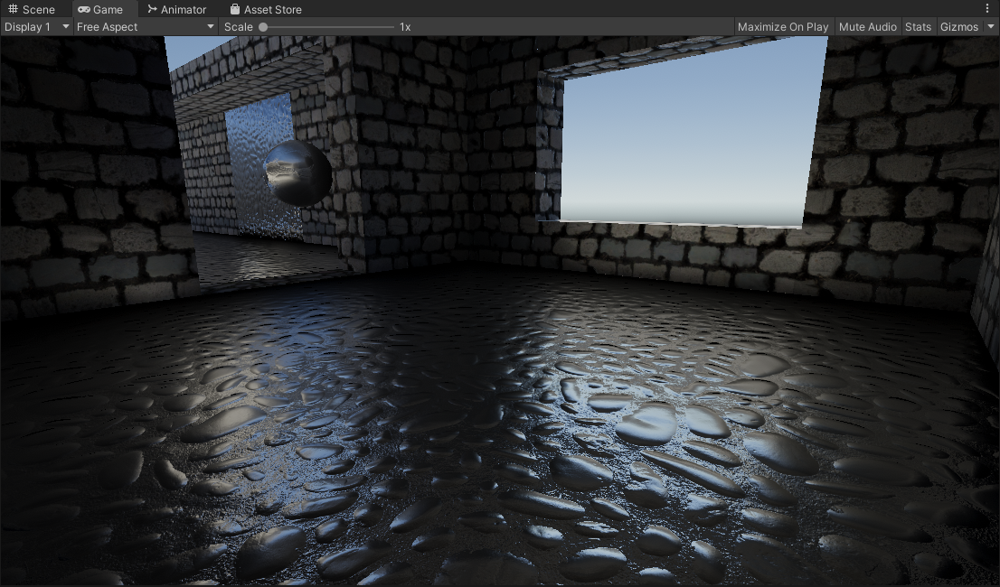

With box occlusion, there is an added darkening that is introduced. Eliminating the glowing apperance. 

***NOTE:*** The material here is a pure metallic/reflective material so the results here can look pretty rough. In cases where you have non-metallic materials this can work well for specular occlusion. It depends on your project/use cases.

### TODO/Ideas:

- Raytraced: Reflection-Luminance Importance Sampling
- Bevel Box Projection: Fix Artifacts

### Credits / Sources

- **[Inigo Quilez](https://iquilezles.org/articles/intersectors/)**: Beveled Box Code
- **[Christoph Peters](http://momentsingraphics.de/BlueNoise.html)**: Free blue noise textures.
- **[Unity HDRP](https://github.com/Unity-Technologies/Graphics/blob/504e639c4e07492f74716f36acf7aad0294af16e/Packages/com.unity.render-pipelines.high-definition/Runtime/Lighting/)**: Approximated Distance Based Roughness Implementation
- **[Unity SRP Core](https://github.com/Unity-Technologies/Graphics/blob/504e639c4e07492f74716f36acf7aad0294af16e/Packages/com.unity.render-pipelines.core/ShaderLibrary/)**: Various Functions
- **[Unity.cginc](https://github.com/TwoTailsGames/Unity-Built-in-Shaders/blob/master/CGIncludes/)**: Unity Box Projection
- **[Cactus_On_Fire](https://www.reddit.com/r/Unity3D/comments/rtmtfz/i_made_a_shader_that_accurately_diffuses_the/)**: Inital inspiration
- **George**: Tipping me off to Unity HDRP's implementation