# Improved Box Projected Reflections
A work-in-progress attempt at improving Box Projected Reflections within unity.

## Contact Hardening

#### Contact Hardening: None
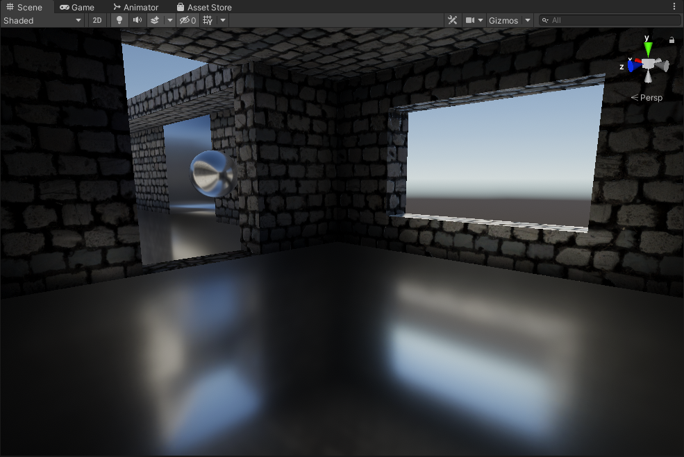

The issue with how box projected reflections are typically done is that when sampled, the roughness of the reflection is consistent regardless of camera position, and object position. 

With that there are a couple of implementations here that attempt to alleviate that problem and make them more true to life and higher fidelity.

#### Contact Hardening: Approximated
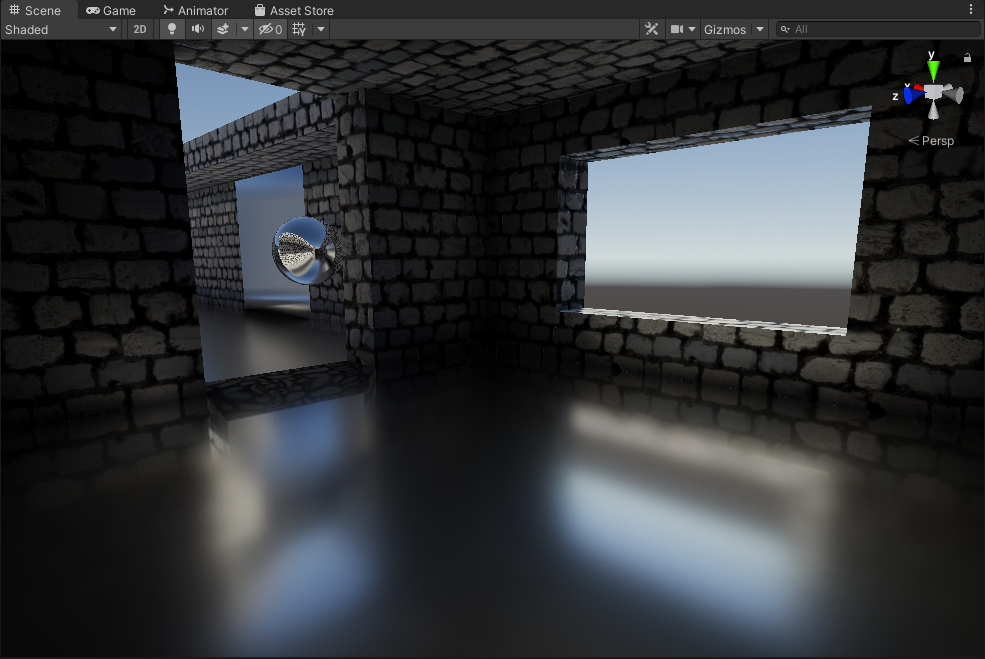

This is done by modifying unity's existing box projection method to output a hit distance from the bounds of the box, to where the object is. Using the hit distance it offsets the mip level to be sharper when closer to the bounds of the probe, and rougher when farther from the bounds. It's very cheap and fast, though not accurate as it fails to model anisotropic reflections.

#### Contact Hardening: Traced
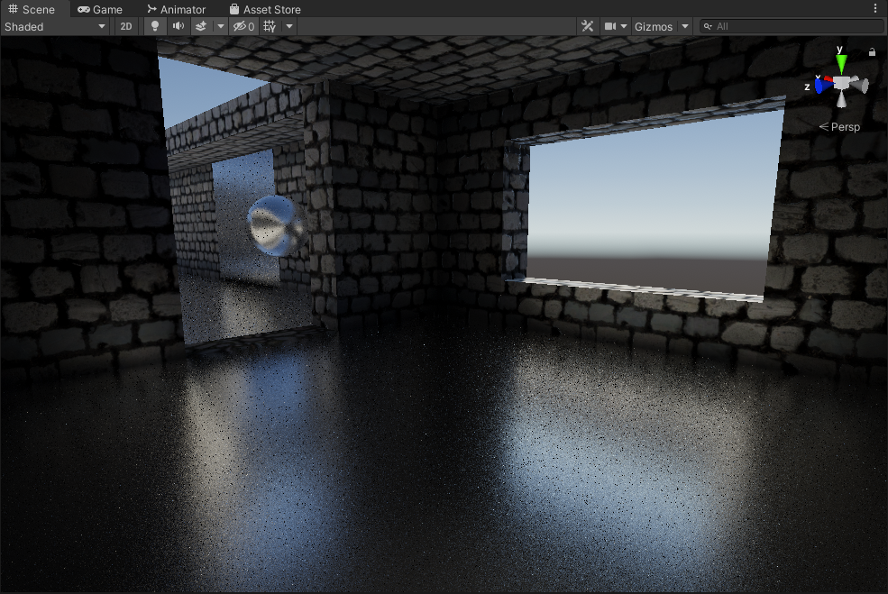

This is a more accurate way of handling reflections. Using multiple randomized samples, and GGX to model roughness. It's also expensive at high sample counts. *(more work to be done here)*

## Beveled Box Projection

#### Beveled Box Projection: Off
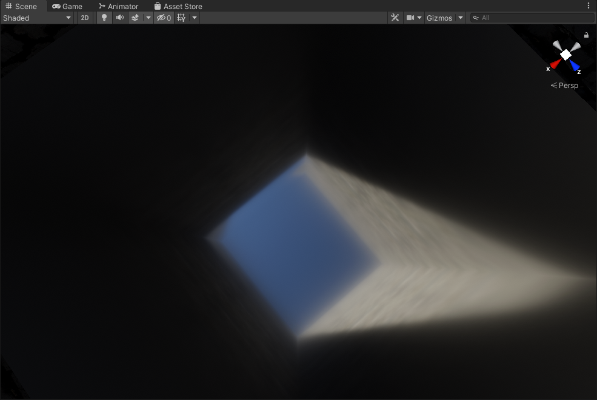

Classic box projection, it's fast but has sharp edges and can look jarring especially when the cubemap is sampled at a higher mip level.

#### Beveled Box Projection: On
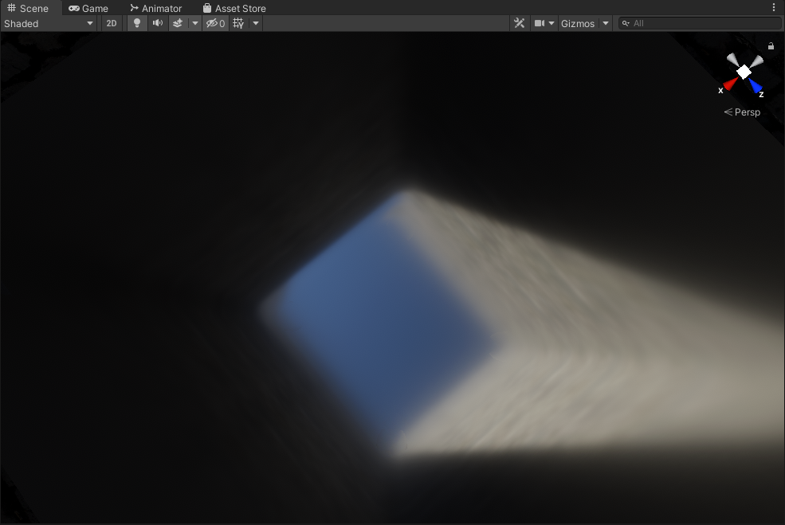

Using a beveled box projection with an adjustable bevel factor. Idea is to smooth out the sharp edges you'd get with the classic method. Has artifacts at high bevel values.

### TODO:

- Use Blue Noise for better perceptual quality.
- Use reflection cubemap luminance to allocate more rays to brighter areas.
- Use mips to reduce noise and the amount of rays needed.
- Option for animated noise
- Quad Intrinsics?

## Results

*No Contact Hardening*
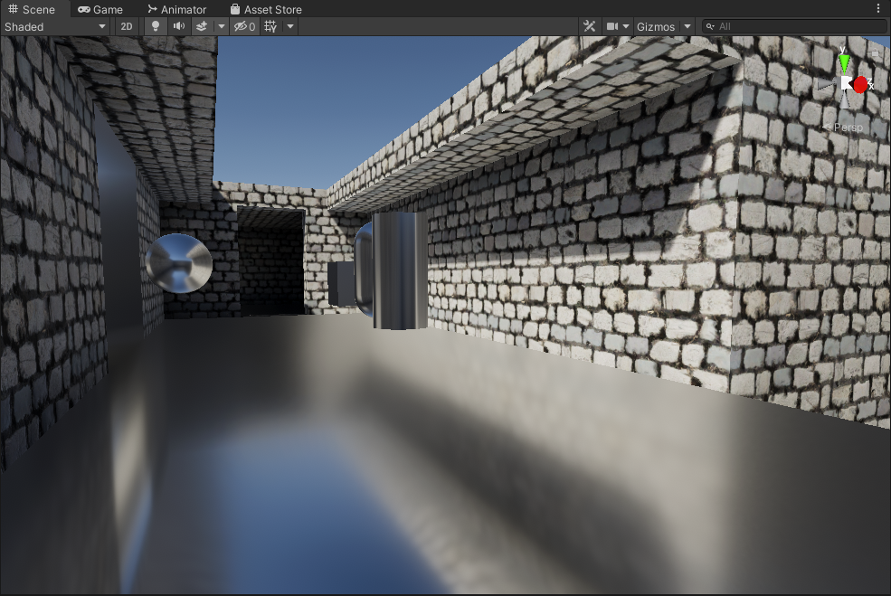

*Approximated Contact Hardening*
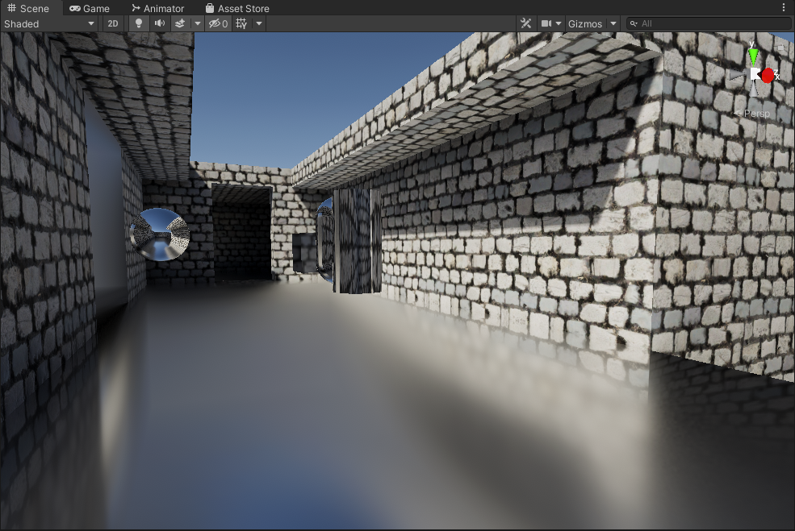

*Traced Contact Hardening*
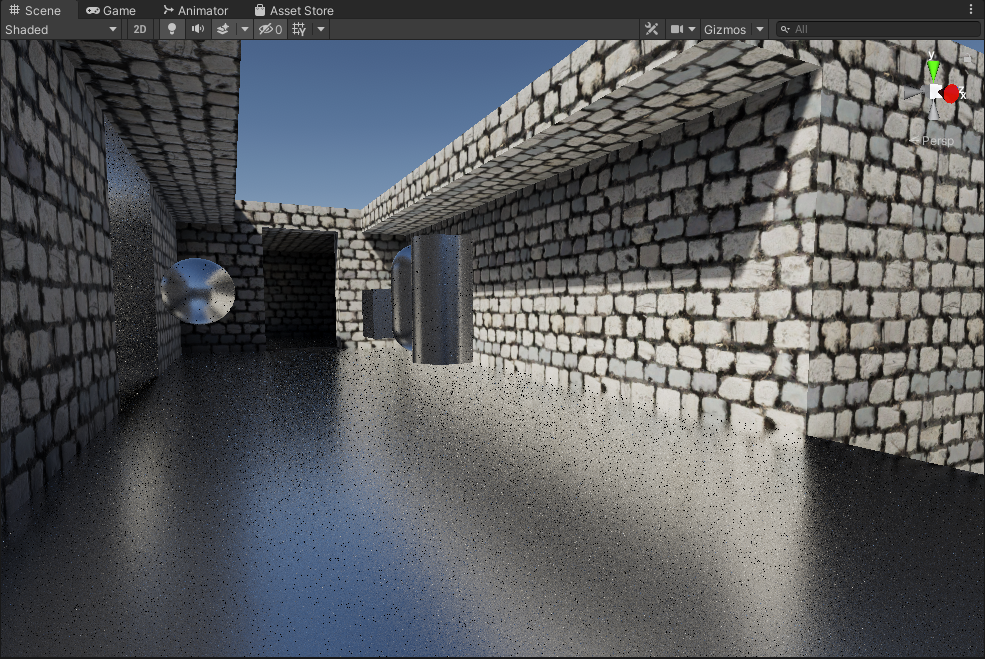

*Normal Maps with No Contact Hardening*
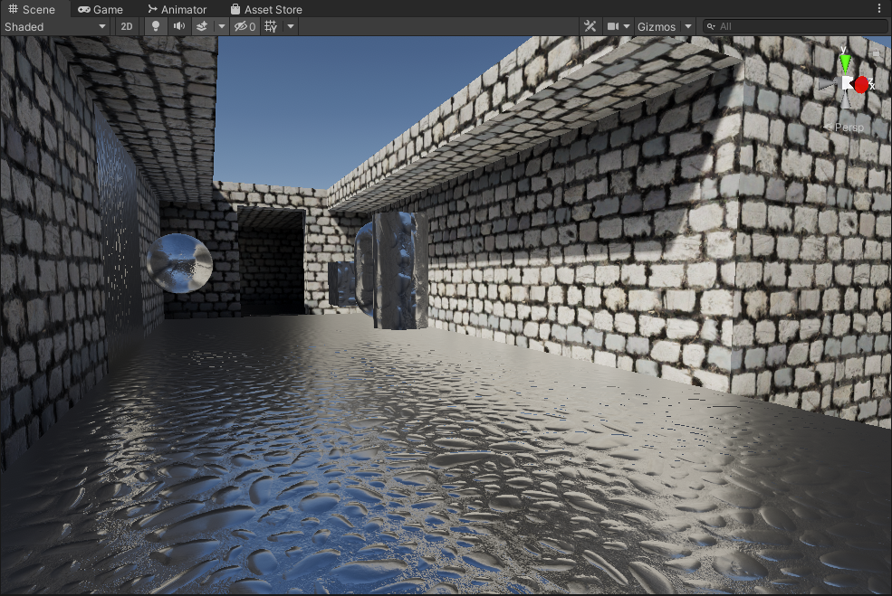

*Normal Maps with Approximated Contact Hardening*

*Normal Maps with Traced Contact Hardening*
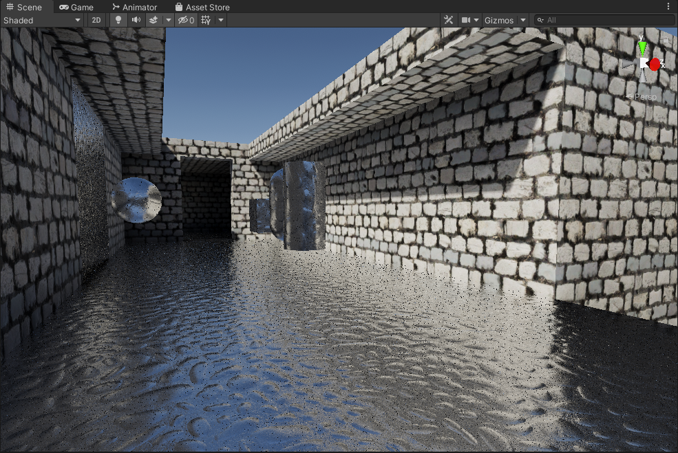

*No Contact Hardening*
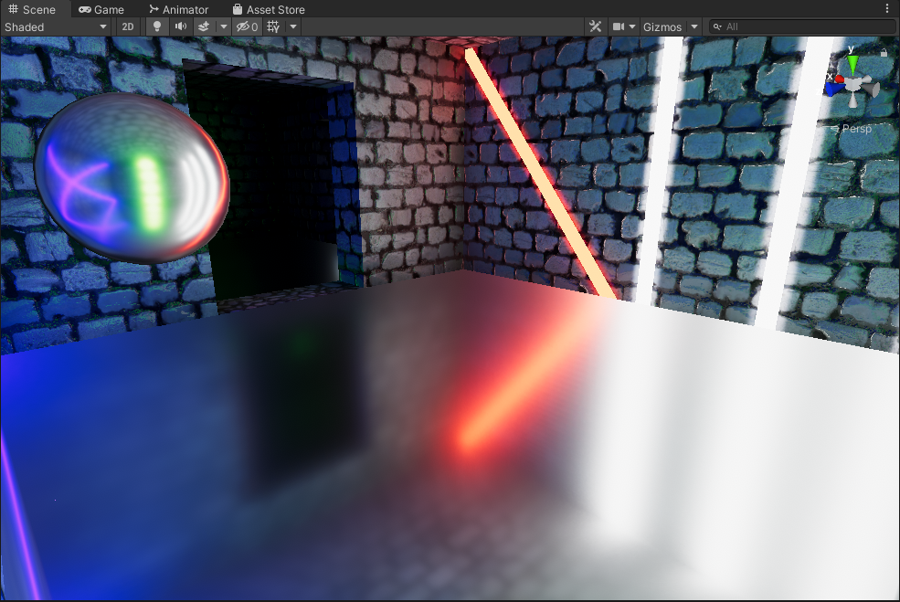

*Approximated Contact Hardening*
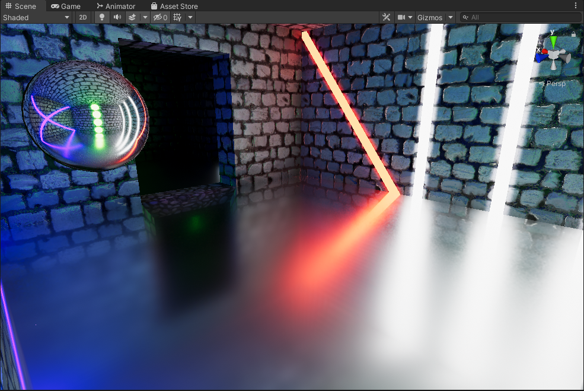

*Traced Contact Hardening*
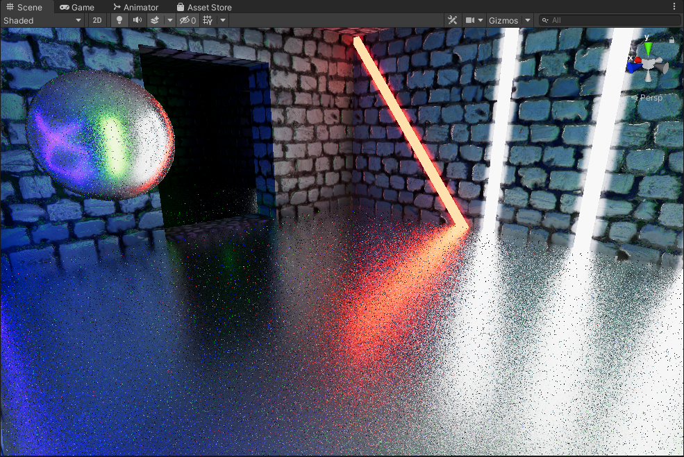